## Colour names

You can use these colour names

### Red colours
lightsalmon
salmon
darksalmon
lightcoral
indianred
crimson
firebrick
red
darkred
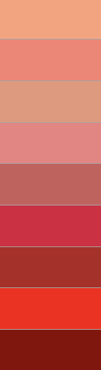

### Orange colours
coral
tomato
orangered
gold
orange
darkorange
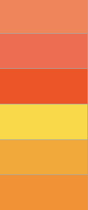

### Yellow colours
lightyellow
lemonchiffon
lightgoldenrodyellow
papayawhip
moccasin
peachpuff
palegoldenrod
khaki
darkkhaki
yellow
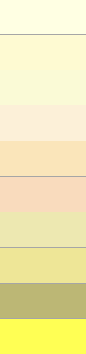

### Green colours
lawngreen
chartreuse
limegreen
lime
forestgreen
green
darkgreen
greenyellow
yellowgreen
springgreen
mediumspringgreen
lightgreen
palegreen
darkseagreen
mediumseagreen
seagreen
olive
darkolivegreen
olivedrab
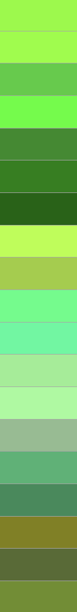

### Cyan colours
lightcyan
cyan
aqua
aquamarine
mediumaquamarine
paleturquoise
turquoise
mediumturquoise
darkturquoise
lightseagreen
cadetblue
darkcyan
teal
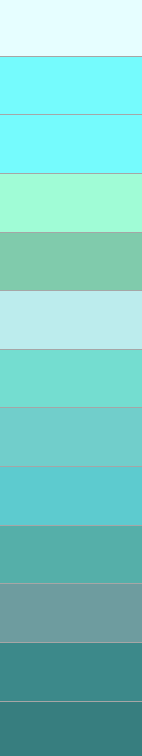

### Blue colours
powderblue
lightblue
lightskyblue
skyblue
deepskyblue
lightsteelblue
dodgerblue
cornflowerblue
steelblue
royalblue
blue
mediumblue
darkblue
navy
midnightblue
mediumslateblue
slateblue
darkslateblue
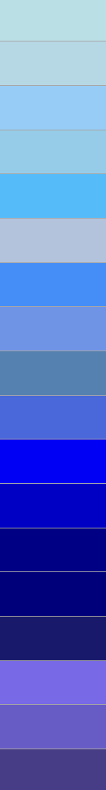

### Purple colours
lavender
thistle
plum
violet
orchid
fuchsia
magenta
mediumorchid
mediumpurple
blueviolet
darkviolet
darkorchid
darkmagenta
purple
indigo
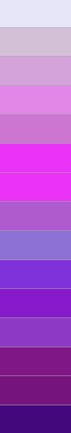

### Pink colours
pink
lightpink
hotpink
deeppink
palevioletred
mediumvioletred
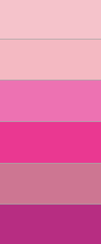

### White colours
white
snow
honeydew
mintcream
azure
aliceblue
ghostwhite
whitesmoke
seashell
beige
oldlace
floralwhite
ivory
antiquewhite
linen
lavenderblush
mistyrose
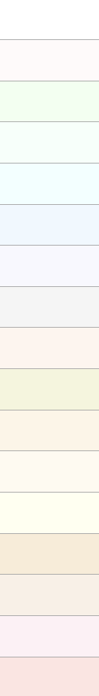

### Grey colours
gainsboro
lightgray
silver
darkgray
gray
dimgray
lightslategray
slategray
darkslategray
black
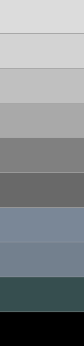

### Brown colours
cornsilk
blanchedalmond
bisque
navajowhite
wheat
burlywood
tan
rosybrown
sandybrown
goldenrod
peru
chocolate
saddlebrown
sienna
brown
maroon
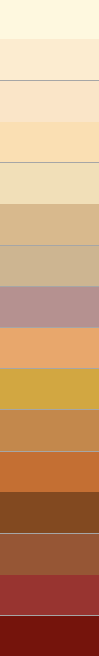
